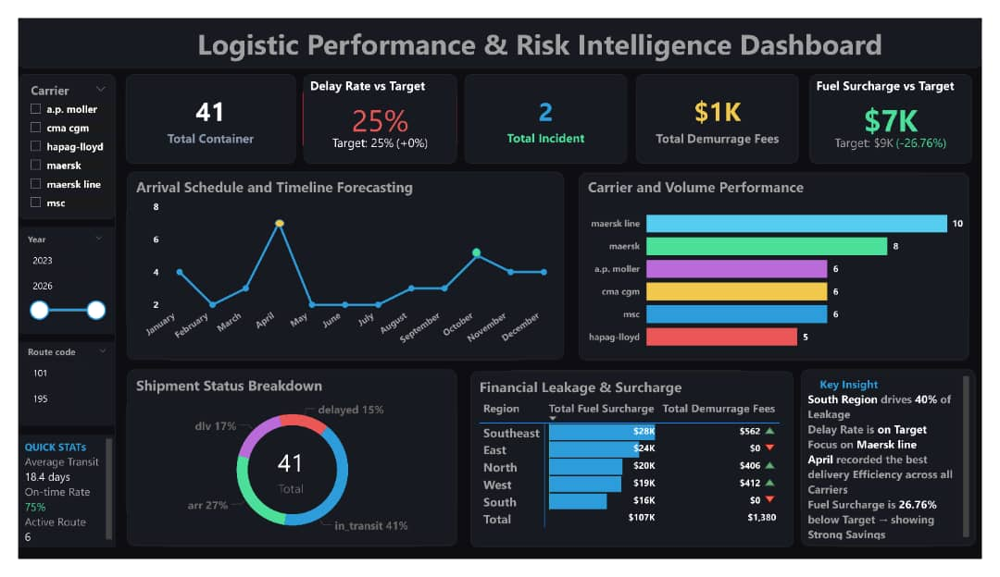
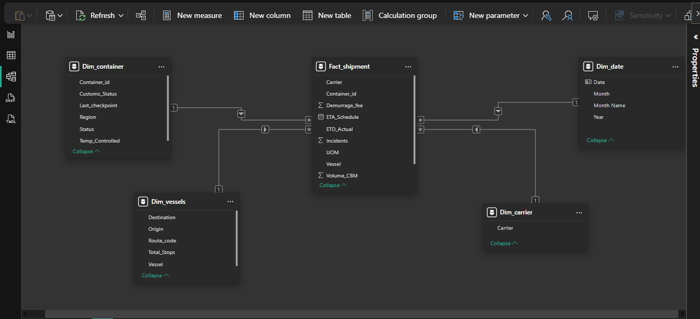
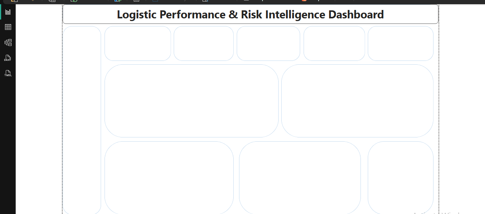

# Logistics-Performance-Risk-Intelligence-Dashboard

In global supply chain management, operational visibility is the difference between profitability and compounding losses. Unexpected transit delays, carrier inefficiencies, and unmonitored financial penalties often go unnoticed when buried in traditional spreadsheets. 
This project delivers an enterprise-grade Business Intelligence solution designed to centralize fractured logistics data into a cohesive, high-contrast executive workspace. By shifting focus from retroactive reporting to predictive risk intelligence, this dashboard equips supply chain leaders with the granular visibility required to protect margins, hold vendors accountable, and streamline global transit pipelines.

---

## Dashboard Image

*Figure 1.0: Live interface featuring a high-contrast premium dark aesthetic, optimized for strategic operational monitoring and rapid decision-making.*

## 📊 Data Modeling Architecture

## 🧠 Dashboard Wireframe

---

## Project Overview

This dashboard serves as a strategic command center for logistics and operations executives. It integrates fragmented datasets across international shipping lines, regional fulfillment lanes, and billing departments into a single-pane-of-glass architecture. 
Rather than simply displaying historical volume, the system actively maps operational reality against organizational goals—providing automated variance alerts, identifying cost leaks before they mature into heavy operational losses, and providing a dynamic timeline to forecast arrivals across multiple regions.

---

## 💼 Business Problem

Modern logistics networks suffer from massive operational blind spots, resulting in severe bottom-line vulnerabilities:
* **Unmonitored Financial Leakage:** Hidden supply chain costs, specifically ballooning regional demurrage fees and unvetted fuel surcharges, consistently cause budget overruns without clear accountability.
* **Carrier Underperformance:** Without unified, data-driven vendor profiling, identifying which carrier consistently drives delays across specific lanes becomes an iterative guessing game.
* **Reactive Exception Management:** Supply chain teams lack visibility into target-vs-actual delay rates, forcing them to address logistics logjams reactively rather than preemptively routing shipments around bottlenecks.

---

## 💡 Key Insights

Analysis of the operational intelligence data reveals several critical areas requiring immediate administrative oversight:
* 🌍 **South Region Risk Concentration:** The Southern regional sector is responsible for **40% of all financial leakage** across the network, marking it as the primary operational vulnerability.
* 📦 **Carrier Volume Concentration:** *Maersk Line* firmly commands the highest container volume, making overall operational stability highly dependent on this single partnership.
* ✅ **Baseline Delay Stability:** The system-wide delay rate is holding stable exactly at the target of **25%**, showing zero unexpected baseline deviations.
* 💰 **Cost Mitigation Success:** Fuel surcharges are running **26.76% below target**, indicating robust structural cost savings and high efficiency in fuel-hedging strategies.
* 📅 **Peak Efficiency Timelines:** Historical records pinpoint **April** as the month achieving the absolute highest delivery efficiency across all active shipping lines.

---

## 🎯 Strategic Recommendations

Based on the intelligence surfaced by the dashboard, executive leadership should execute the following data-backed measures:
1. **Targeted Southern Audit:** Launch an immediate process-efficiency audit into the Southern Region's port operations to identify and mitigate the systemic root causes behind that 40% financial leakage.
2. **Carrier De-risking & Negotiation:** Leverage the carrier volume data to negotiate volume-discount tiering with Maersk Line, while systematically routing minor volumes to secondary lines (MSC, CMA CGM) to build structural redundancy.
3. **Institutionalize April Best Practices:** Run a comparative post-mortem analysis on April's historical logistics data to uncover the exact operational parameters that drove peak efficiency, then standardize those practices year-round.

---

## 🛠️ Tech Stack

* **Power BI Desktop:** Core platform used to engineer the interface layout, UX flow, and executive reporting canvas.
* **DAX (Data Analysis Expressions):** Engineered to write scalable measures computing time intelligence, running targets, dynamic variances, and KPI tracking alerts.
* **Power Query (M):** Utilized to execute structural data engineering, dataset merging, entity cleaning, and dimensional transformation.
* **Data Modeling Architecture:** Modeled explicitly using a **Star Schema** (Fact and Dimension tables) to ensure instant filter propagation, zero redundancy, and ultra-fast visual rendering speeds.

---

## 🧩 Dashboard Architecture

### Visual Components Breakdown
| Section | Visual Type | Measured Metrics & Core Focus |
| :--- | :--- | :--- |
| **KPI Control Center** | High-Contrast Cards | Total Containers, Delay Rate vs Target, Total Incidents, Demurrage Fees, Fuel Surcharge vs Target. |
| **Arrival Timeline** | Predictive Line Chart | Granular tracking of monthly container arrival trajectories across fiscal timelines. |
| **Carrier Performance** | Horizontal Bar Chart | Rank-order sorting of global transit carriers based on absolute volume capacity. |
| **Shipment Status** | Proportional Donut Chart | Lifecycle segmentation showing distribution across *In Transit, Arrived, Delivered,* and *Delayed*. |
| **Financial Leakage** | Matrix Table | Regional mapping cross-referencing fuel surcharges alongside penalizing demurrage costs. |
| **Executive Insights** | Narrative Callouts | Dynamically generated smart narrative summaries highlighting anomalous supply chain occurrences. |

##  Key Features
- Dynamic KPI variance tracking
- Delay rate benchmarking
- Financial leakage monitoring
- Carrier performance ranking
- Predictive shipment timeline analysis
- Executive smart narrative reporting
- Interactive drill-through filtering

### 🔍 Interactive Filters & Slicers
* **Carrier Slicer:** Filters the entire report canvas to isolate specific maritime shipping networks.
* **Year Timeline Slider:** Allows smooth, continuous toggling to cross-compare performance changes between **2023** and **2026**.
* **Route Code Filter:** Deep-dives directly into localized lanes (e.g., *Route 101, Route 195*) to isolate hyper-local transit exceptions.

---

## 🏁 Conclusion

By combining advanced data modeling with user-centric design, this dashboard shifts logistics management from a state of firefight to a state of control. It transforms raw, disconnected shipping logs into operational truth. For the business, this means fewer delayed containers, total visibility over vendor capabilities, and an immediate reduction in unvetted regional financial losses.

---

## 👤 Author

**Omobolaji Kehinde Zachariah**  
*Data Analyst & Business Intelligence Specialist*  

I build enterprise-scale data products that convert analytical complexity into boardroom strategy. If you would like to discuss the underlying DAX logic, optimize data schemas, or talk about BI implementation, connect with me below:

📧 [Email Me](mailto:komobolaji20@gmail.com)  
🔗 [LinkedIn Profile](https://www.linkedin.com/in/omobolaji-zachariah-05118520b) | 🌐 [Professional Portfolio Website](https://komobolaji20-droid.github.io/)
